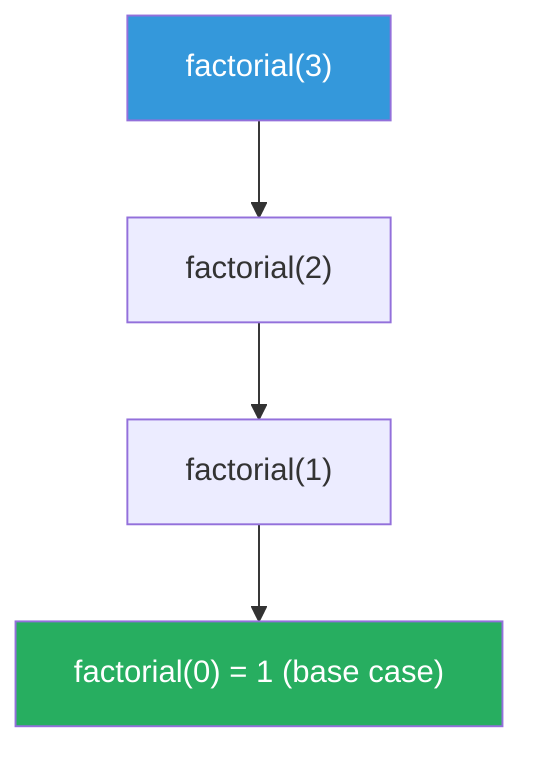

# Recursion

**TL;DR:** A function that solves a problem by calling a smaller version of itself, relying on the call stack to remember where to resume once the smaller call returns.

## When to reach for it
- The problem has a natural self-similar structure: "solve this for `n`, given you've already solved it for `n-1`" (or for a smaller subtree, sublist, or substring).
- Tree and graph traversal — "visit every node" is naturally "visit this node, then recurse on its children."
- Backtracking / exhaustive search — build a partial solution, recurse to extend it, undo, try the next option.
- Divide and conquer — split into independent subproblems and recurse on each (see [[Divide and Conquer]]).
- You catch yourself trying to manually manage a stack of "things to come back to" — that's the call stack's job; let recursion do it.

## How it works
Every recursive call needs two ingredients: a **base case** (a small enough input that you can answer directly, no further recursion) and a **recursive case** (do a little work, then call yourself on a strictly smaller input, and combine that result with the work you just did). Each call gets its own stack frame holding its local variables and "return address" — the point in the calling frame to resume once the recursive call comes back.

Trace `factorial(3)`:

| call | waits for | frame holds |
|---|---|---|
| `factorial(3)` | `factorial(2)` | `n=3`, pending `* 3` |
| `factorial(2)` | `factorial(1)` | `n=2`, pending `* 2` |
| `factorial(1)` | `factorial(0)` | `n=1`, pending `* 1` |
| `factorial(0)` | — (base case) | `n=0`, returns `1` |

Then the stack unwinds: `1 → 1*1=1 → 1*2=2 → 2*3=6`.



The stack grows on the way down (each call pauses, waiting on the next) and unwinds on the way up (each paused call resumes with the answer it was waiting for).

## Why it works
Correctness rests on two disciplines: the base case must be **reachable** (every call moves strictly closer to it — smaller `n`, shorter list, smaller subtree), and the recursive case must be **correct assuming the smaller call already works** — an inductive argument: if `factorial(n-1)` is correct, then `n * factorial(n-1)` is correct for `factorial(n)`. You only verify the one-step reduction; induction guarantees the rest. Skip either discipline and you get infinite recursion or a wrong answer.

**Recursion tree → complexity.** Draw one node per call, with children for the calls it makes; total work is the sum across every node. A chain that does O(1) work per level (the factorial trace above) has `n` nodes — O(n) total. A call that branches into two recursive calls at every level (naive Fibonacci) has roughly `2^n` nodes — O(2^n) total, which is why memoizing it (see [[Memoization]]) collapses the same tree back to O(n).

## When to convert to iteration
Convert when recursion depth could exceed the stack limit (Python's default is ~1000 frames — recursively walking a 10,000-node linked list will crash), or when frame overhead matters for performance. The mechanical fix: maintain your own explicit stack holding what a frame would have held, and pop/process in a loop instead — see [[Stack]]. Skip the conversion when depth is bounded (O(log n) for balanced trees or divide-and-conquer) — native recursion is simpler and the stack depth is never a real risk.

## Template
```python
def recurse(state):
    if is_base_case(state):
        return base_result(state)          # 1. base case — must be reachable

    smaller_result = recurse(shrink(state)) # 2. recursive case — strictly smaller input
    return combine(state, smaller_result)   # 3. combine with current-level work

# Multi-branch (tree / backtracking) shape
def recurse(state):
    if is_base_case(state):
        record(state)
        return
    for choice in options(state):
        recurse(apply(state, choice))       # branches into multiple recursive calls
```

## Complexity
Time: depends on the recursion tree's shape — linear chain (one recursive call per frame) is O(n) calls total; branching into `b` calls at each of `d` levels gives O(b^d) calls, unless overlapping subproblems let memoization collapse it. Space: O(depth) for the call stack alone, plus whatever each frame stores — a balanced binary tree traversal is O(log n) stack depth, a skewed one is O(n).

## Common pitfalls
- Base case that's never reached — e.g. shrinking by the wrong amount, or a condition that can't match the actual sequence of states (infinite recursion, eventually a `RecursionError`).
- Redoing identical subproblems (naive Fibonacci recomputes `fib(n-2)` many times) — recognize overlapping subproblems and add memoization rather than accepting exponential blowup.
- Forgetting that each stack frame costs real memory — a "clean" recursive solution can silently be worse in space than an iterative one, even with the same time complexity.
- Mutating shared state (a list or set passed by reference) without undoing the mutation before returning — backtracking specifically depends on restoring state after each branch, not just moving forward.

## NeetCode examples
- [[01.Subsets|Subsets]] — recursion tree of include/exclude choices
- [[03.Permutations|Permutations]] — recursion with backtracking and shared-state undo
- [[06.Pow(x,n)|Pow(x,n)]] — recursion that halves the problem each call (log-depth tree)
- [[02.MaxDepthOfBinaryTree|MaxDepthOfBinaryTree]] — recursion mirrors the tree's own recursive structure

## Full guide
[[Job Search/Neetcode/01. Questions/10. Backtracking/0.BacktrackingGuide|Backtracking Guide]]
