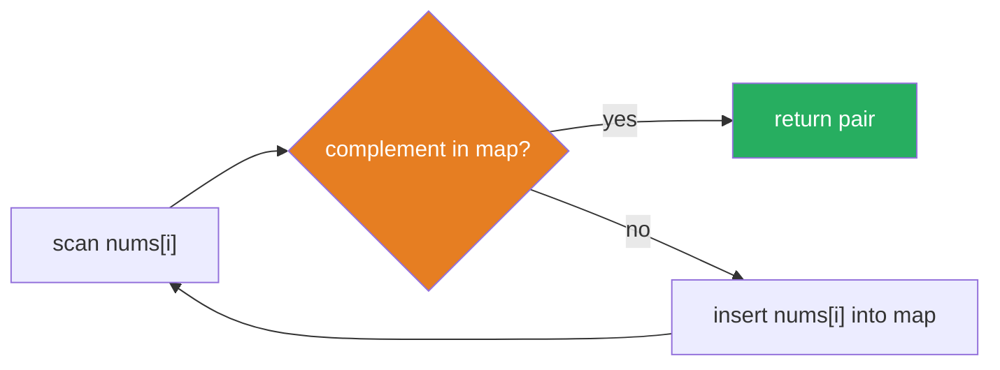

# Space-Time Tradeoff

**TL;DR:** Spend extra memory to avoid repeating work, turning a slow brute-force scan into a fast lookup.

## When to reach for it
- Brute force is O(n²) or worse because you're re-scanning the input to answer "have I seen this before" or "what's the complement of this value" — an auxiliary structure can answer that in O(1).
- You'd otherwise recompute the same subresult many times (see [[Recursion]] and [[Memoization]]) — cache it instead.
- A single query needs to be answered fast, repeatedly, and it's worth paying an upfront cost once to make every later query cheap (prefix sums, precomputed tables).
- The problem constraints allow O(n) extra space but demand better than O(n²) time — that ratio is a strong hint a lookup structure is the intended trick.

## How it works
The general move: build an auxiliary structure once (cost paid up front), then use it to turn a query that used to require a scan into a single lookup. Trace the classic case — [[03.TwoSum|TwoSum]] — on `nums = [2, 7, 11, 15]`, `target = 9`:

| i | nums[i] | complement (target - nums[i]) | seen so far (hash map) | found? |
|---|---|---|---|---|
| 0 | 2 | 7 | `{}` | 7 not in map → insert `2: 0` |
| 1 | 7 | 2 | `{2: 0}` | 2 **is** in map → return `[0, 1]` |

Brute force would re-scan the remaining array for each `i` looking for the complement — O(n) work repeated `n` times, O(n²) total. The hash map remembers every value seen so far, so checking "does the complement exist" is an O(1) lookup instead of an O(n) scan — the map costs O(n) extra space, but collapses the total time to O(n).



## Why it works
The tradeoff is a direct exchange: every unit of information you're willing to store (in a hash map, a precomputed array, a memo table) is a unit of *re-derivation* you no longer have to pay for later. The invariant that makes it correct: the auxiliary structure must always reflect exactly the information available "so far" at the point you query it — in Two Sum, the map only ever contains values from indices strictly before the current one, so a match found is guaranteed to be a valid, already-seen pair, and you never miss a match because the map never lags behind or looks ahead incorrectly.

## Typical forms
- **Caching / memoization** — store results of expensive computations so repeat calls with the same input are O(1); the standard fix for recursion trees with overlapping subproblems (see [[Recursion]] and [[Divide and Conquer]]).
- **Auxiliary lookup structures** — hash maps and sets turn O(n) "does this exist" scans into O(1) checks; this is the single most common space-time trade in interview problems.
- **Prefix sums** — precompute cumulative sums once in O(n), then answer any range-sum query in O(1) instead of re-summing the range every time.
- **Precomputed tables** — trade a one-time O(n) (or O(n log n)) setup for O(1) or O(log n) answers to many repeated queries afterward.

## Template
```python
# Auxiliary hash map: turn an O(n) scan into O(1) lookup
def two_sum(nums, target):
    seen = {}                      # value -> index, O(n) extra space
    for i, num in enumerate(nums):
        complement = target - num
        if complement in seen:      # O(1) lookup instead of O(n) rescan
            return [seen[complement], i]
        seen[num] = i
    return []

# Prefix sum: O(n) upfront, O(1) per range-sum query afterward
def build_prefix(nums):
    prefix = [0] * (len(nums) + 1)
    for i, num in enumerate(nums):
        prefix[i + 1] = prefix[i] + num
    return prefix

def range_sum(prefix, left, right):   # inclusive [left, right]
    return prefix[right + 1] - prefix[left]
```

## Complexity
Time: the whole point is reducing time — typically from O(n²) or worse down to O(n) or O(n log n) — at the cost of extra space. Space: O(n) extra for a hash map or prefix-sum array, versus O(1) extra for the brute-force approach it replaces; the tradeoff is only worth it when the time savings matter more than the memory cost (almost always true under interview constraints).

## Common pitfalls
- Building the auxiliary structure but still scanning it linearly for each query — the structure only helps if the lookup itself is O(1) or O(log n), not if you replaced one scan with another.
- Populating the lookup structure with information from the *future* relative to the current query, which can produce a match that isn't actually valid yet (order matters — see the Two Sum trace above).
- Precomputing a table larger or more expensive to build than the savings justify — trading O(n) space for a saving that only fires once isn't worth the complexity.
- Forgetting the auxiliary space counts toward the space complexity you report — "O(n) time, O(1) space" is wrong if you used a hash map.

## See also
- [[Hash Map]]
- [[Big-O Notation]]
- [[Recursion]]
