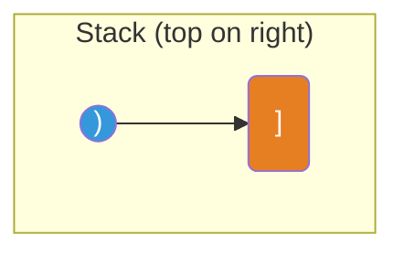

# Stack

**TL;DR:** A last-in-first-out (LIFO) collection — the only thing you can touch is the top, which makes it the natural tool for "undo the most recent thing" problems.

## When to reach for it
- Matching or nesting: parentheses, brackets, tags, nested expressions.
- "Most recent unmatched X" — the next unresolved item is always the top of the stack.
- Evaluating expressions (postfix/infix), where operators need their most-recently-seen operands.
- Converting a recursive process into an explicit iterative one (simulate the call stack yourself) — see [[Recursion]].
- A signal word like "valid," "balanced," "undo," or "nested" in the problem statement.

## How it works
A stack supports exactly two core operations, both O(1): `push` (add to the top) and `pop` (remove from the top). Nothing beneath the top is touched until everything above it is popped first — that ordering is the entire mechanism.

Trace validating `"([)]"` versus `"([])"` character by character using a stack of expected closers:

| char | action | stack after |
|---|---|---|
| `(` | push `)` | `[')']` |
| `[` | push `]` | `[')', ']']` |
| `)` | top is `]`, expected `)` → **mismatch, invalid** | — |

Now `"([])"`:

| char | action | stack after |
|---|---|---|
| `(` | push `)` | `[')']` |
| `[` | push `]` | `[')', ']']` |
| `]` | top is `]` → matches, pop | `[')']` |
| `)` | top is `)` → matches, pop | `[]` |
| end | stack empty → **valid** | — |



In Python, a plain `list` is a fully adequate stack: `append()` pushes, `pop()` pops, both O(1) amortized.

## Why it works
The invariant a stack gives you for free: **whatever is on top is always the most recently added, not-yet-resolved item.** For matching problems, that's exactly the semantics you need — the most recently opened bracket must be the next one closed, so checking "does this closer match the top opener" is always the right check, never a stale one further down. For expression evaluation, operands pushed most recently are the operands nearest to the operator currently being processed. The LIFO order isn't incidental — it mirrors the nesting structure of the problem itself.

## Template
```python
# Valid parentheses skeleton
def is_valid(s: str) -> bool:
    pairs = {')': '(', ']': '[', '}': '{'}
    stack = []
    for ch in s:
        if ch in pairs:
            if not stack or stack.pop() != pairs[ch]:
                return False
        else:
            stack.append(ch)
    return not stack   # must be fully matched

# Stack-as-recursion-simulator skeleton
stack = [initial_state]
while stack:
    state = stack.pop()
    if is_base_case(state):
        handle(state)
        continue
    for next_state in expand(state):
        stack.append(next_state)
```

## Complexity
Time: O(n) — each element is pushed once and popped at most once. Space: O(n) worst case — e.g. a string of all-openers pushes every character before anything can pop.

## Common pitfalls
- Popping from an empty stack without checking first — guard with `if not stack` before `stack.pop()`.
- Forgetting to check the stack is empty at the *end* — leftover unmatched openers mean invalid, even if every pop along the way succeeded.
- Using a stack when order doesn't actually matter (e.g. just counting occurrences) — that's needless overhead; a plain counter or [[Hash Map]] is simpler.
- Reaching for a stack for "next greater/smaller element" problems without keeping it *monotonic* — see [[Monotonic Stack]] for the specialized variant that keeps the stack ordered as you go.

## NeetCode examples
- [[01.ValidParentheses|ValidParentheses]] — canonical matching-pairs stack
- [[02.MinStack|MinStack]] — stack augmented to track running minimum in O(1)
- [[03.EvaluateReversePolishNotation|EvaluateReversePolishNotation]] — operands pushed, popped for each operator
- [[04.GenerateParentheses|GenerateParentheses]] — recursion using an implicit call stack to build valid strings

## Full guide
[[Job Search/Neetcode/01. Questions/04. Stack/0.StackGuide|Stack Guide]]
