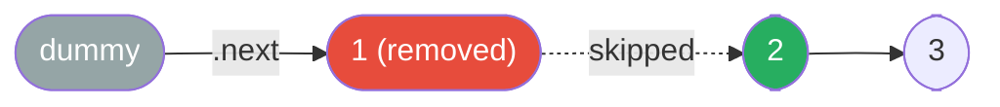

# Dummy Head

**TL;DR:** Prepend a sentinel node before the real head so the head itself is never a special case — you always operate on and return `dummy.next`.

## When to reach for it
- Merging two (or k) sorted lists into one.
- Removing nodes — including possibly the very first node — based on a condition.
- Building a brand-new list by appending nodes one at a time.
- Any operation where the identity of "the head" might change by the time you're done (insertion at front, deletion of front, k-group operations that touch the start).

## How it works
Create a throwaway node, `dummy`, and set `dummy.next = head` (or leave it `None` and build forward). Keep a `curr` pointer that starts at `dummy`. Every time you'd normally write "insert this node as the new head" or "point head to head.next," you instead write it in terms of `curr.next` — because `dummy` is a fixed, always-valid anchor that never itself needs to be replaced.

Trace removing the value `1` from `1 → 2 → 3` (`removeElements`-style):

| step | dummy.next | curr | curr.next.val | action |
|---|---|---|---|---|
| start | `1` | dummy | `1` | `1 == target` → skip it |
| 1 | `1` | dummy | `2` | `curr.next = curr.next.next` (drop the `1` node) |
| 2 | `2` | dummy | `3` | `2 != target` → advance `curr = curr.next` |
| 3 | `2` | `2`-node | `3` | `3 != target` → advance |
| end | `2 → 3` | — | — | return `dummy.next` → `2 → 3` |



Notice the code never had to ask "is this the first node?" — whether the removed node was the original head or somewhere in the middle, the edit is the same one-line rewrite: `curr.next = curr.next.next`.

## Why it works
The invariant: **`dummy` itself is never removed and never reassigned, so `dummy.next` always correctly names "the current head of the result," even as that identity changes underneath it.** Without the dummy, "remove the head" requires physically reassigning the `head` variable — a different code path than "remove an interior node," which just rewires a `.next`. The dummy unifies both into the same operation by making even the head "an interior node" relative to something before it. That's the whole trick: it eliminates a branch by giving every node, including the real head, a predecessor.

## Template
```python
class ListNode:
    def __init__(self, val=0, next=None):
        self.val = val
        self.next = next

dummy = ListNode(0)
dummy.next = head    # or omit this line when building a list from scratch
curr = dummy

# Build / merge / filter loop
while condition:
    curr.next = ListNode(chosen_val)   # or: curr.next = curr.next.next  (removal)
    curr = curr.next                    # advance only when you keep a node

return dummy.next   # real head of the result
```

## Complexity
Time: O(n) — one pass to build, merge, or filter the list; the dummy node itself costs no extra traversal. Space: O(1) extra — a single sentinel node, independent of list length.

## Common pitfalls
- Forgetting to return `dummy.next` instead of `dummy` — you'll leak the sentinel into the result.
- Advancing `curr` even when a node was removed (rather than kept) — this skips checking the node that just slid into `curr.next`'s place.
- Losing the tail pointer by reassigning `curr` to something other than the node you just linked, breaking the chain silently.
- Needing both "the node before the edit point" and "the current node" simultaneously (e.g. deletion needing `prev`) and only tracking one — keep explicit `prev`/`curr` pointers rather than trying to infer one from the other.

## NeetCode examples
- [[02.MergeTwoLinkedList|MergeTwoLinkedList]] — weave two lists using a dummy as the result head
- [[04.RemoveNthNodeFromEndOfTheList|RemoveNthNodeFromEndOfTheList]] — dummy avoids special-casing head removal
- [[10.MergeKSortedLists|MergeKSortedLists]] — dummy + heap to build the merged output
- [[11.ReverseNodesInK-Group|ReverseNodesInK-Group]] — dummy anchors the result while groups are reversed

## Full guide
[[Job Search/Neetcode/01. Questions/06. LinkedList/0.LinkedListGuide|Linked List Guide]]
