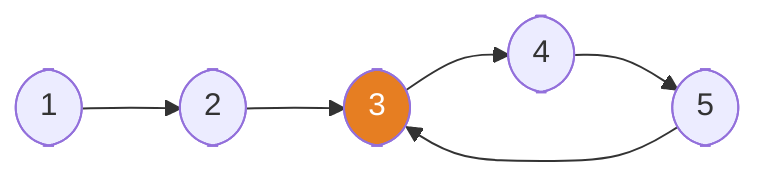

# Fast & Slow Pointers

**TL;DR:** Walk two pointers at different speeds through the same structure — their relative motion reveals cycles, midpoints, and other one-pass structural facts you can't get from a single pointer.

## When to reach for it
- "Detect a cycle," "find the start of a cycle," or "does this list loop back on itself."
- "Find the middle node" in one pass without first counting the length.
- A problem hides a cycle inside an array (e.g. values in `[1, n]` used as implicit next-pointers) — [[08.FindDuplicateNumber|FindDuplicateNumber]] is the classic disguise.
- Any "k-th from the end" phrasing, which is a fixed-gap variant of this same two-pointer idea.

## How it works
Two pointers, `slow` and `fast`, both start at `head`. Each loop iteration, `slow` advances one node and `fast` advances two. Trace it on a cyclic list `1 → 2 → 3 → 4 → 5 → back to 3`:

### Interactive walkthrough

The first phase finds a meeting point inside the cycle. The second phase resets `slow` to the head and moves both pointers one node at a time until they meet at the cycle entrance.

```freeform
const positions = {
    1: [55, 105],
    2: [145, 105],
    3: [235, 105],
    4: [330, 62],
    5: [420, 105],
};
const edges = [[1, 2], [2, 3], [3, 4], [4, 5]];
const steps = [
    { phase: "Find a meeting point", slow: 1, fast: 1, line: 1, result: "No meeting point yet", action: "Start both pointers at node 1." },
    { phase: "Find a meeting point", slow: 2, fast: 3, line: 3, result: "No meeting point yet", action: "Move slow to 2 and fast to 3." },
    { phase: "Find a meeting point", slow: 3, fast: 5, line: 3, result: "No meeting point yet", action: "Move slow to 3 and fast to 5." },
    { phase: "Find a meeting point", slow: 4, fast: 4, line: 4, result: "Cycle detected at node 4", action: "Meet at node 4, which confirms that the list has a cycle." },
    { phase: "Find the cycle entrance", slow: 1, fast: 4, line: 5, result: "Entrance not found yet", action: "Reset slow to node 1 and leave fast at node 4." },
    { phase: "Find the cycle entrance", slow: 2, fast: 5, line: 7, result: "Entrance not found yet", action: "Move both pointers one node to reach 2 and 5." },
    { phase: "Find the cycle entrance", slow: 3, fast: 3, line: 8, result: "Cycle entrance = node 3", action: "Meet at node 3, which is the cycle entrance." },
];

const root = document.createElement("section");
root.style.cssText = "font:14px system-ui; max-width:700px; border:1px solid var(--background-modifier-border); border-radius:10px; padding:12px; background:var(--background-primary); color:var(--text-normal);";
root.innerHTML = `
    <style>
        .fs-svg { width:100%; height:auto; display:block; }
        .fs-states { display:grid; grid-template-columns:1fr 1fr; gap:8px; margin-top:8px; }
        .fs-code { overflow-x:auto; font-size:13px; }
        .fs-controls { display:flex; align-items:center; gap:8px; flex-wrap:wrap; margin-top:10px; }
        .fs-controls button, .fs-controls select { min-height:44px; font-size:14px; touch-action:manipulation; }
        .fs-controls button { padding:6px 12px; }
        @media (max-width:520px) {
            .fs-states { grid-template-columns:1fr; }
            .fs-code { font-size:12px; }
            .fs-controls { gap:6px; }
            .fs-controls button { flex:1 1 72px; }
            .fs-speed { flex:1 1 100%; display:flex; align-items:center; gap:8px; }
            .fs-speed select { flex:1; }
            .fs-counter { width:100%; margin-left:0 !important; text-align:center; }
        }
    </style>
    <svg class="fs-svg" viewBox="0 0 480 235" preserveAspectRatio="xMidYMid meet" role="img" aria-label="Fast and slow pointers before the first step">
        <defs>
            <marker id="fs-arrow" viewBox="0 0 10 10" refX="9" refY="5" markerWidth="7" markerHeight="7" orient="auto-start-reverse">
                <path d="M 0 0 L 10 5 L 0 10 z" fill="#566573"></path>
            </marker>
        </defs>
        <text x="240" y="24" text-anchor="middle" font-size="17" font-weight="700" fill="#17202a">1 -> 2 -> 3 -> 4 -> 5 -> 3</text>
        <g data-layer="edges"></g>
        <g data-layer="nodes"></g>
        <g data-layer="pointers"></g>
        <text x="240" y="220" text-anchor="middle" font-size="14" font-weight="600" fill="#34495e" data-role="svg-note"></text>
    </svg>
    <div style="display:flex; gap:12px; flex-wrap:wrap; margin:0 0 8px; font-size:12px;">
        <span>Blue = slow</span><span>Orange = fast</span><span>Purple = both</span><span>Green = entrance</span>
    </div>
    <div data-role="status" aria-live="polite" style="min-height:22px; padding:9px 10px; border-radius:8px; background:var(--background-secondary);"></div>
    <div class="fs-states">
        <div style="padding:8px; border:1px solid var(--background-modifier-border); border-radius:8px;"><strong>Phase and pointers</strong><div data-role="pointers" style="margin-top:4px;"></div></div>
        <div style="padding:8px; border:1px solid var(--background-modifier-border); border-radius:8px;"><strong>Result</strong><div data-role="result" style="margin-top:4px;"></div></div>
    </div>
    <pre class="fs-code" data-role="code" style="padding:9px; border-radius:8px; background:var(--background-secondary);"><code><span data-line="1">slow = fast = head</span>\n<span data-line="2">while fast and fast.next:</span>\n<span data-line="3">    slow = slow.next; fast = fast.next.next</span>\n<span data-line="4">    if slow is fast: break</span>\n<span data-line="5">slow = head</span>\n<span data-line="6">while slow is not fast:</span>\n<span data-line="7">    slow = slow.next; fast = fast.next</span>\n<span data-line="8">return slow</span></code></pre>
    <div class="fs-controls">
        <button type="button" data-action="previous">Previous</button>
        <button type="button" data-action="play">Play</button>
        <button type="button" data-action="next">Next</button>
        <button type="button" data-action="reset">Reset</button>
        <label class="fs-speed">Speed <select data-action="speed"><option value="1600">Slow</option><option value="950" selected>Normal</option><option value="500">Fast</option></select></label>
        <span class="fs-counter" data-role="counter" style="margin-left:auto;"></span>
    </div>
`;

const svg = root.querySelector("svg");
const ns = "http://www.w3.org/2000/svg";
let index = 0;
let timer = null;

function svgElement(name, attrs, text) {
    const node = document.createElementNS(ns, name);
    for (const [key, value] of Object.entries(attrs)) node.setAttribute(key, String(value));
    if (text !== undefined) node.textContent = text;
    return node;
}

function stopPlaying() {
    if (timer !== null) clearInterval(timer);
    timer = null;
    root.querySelector('[data-action="play"]').textContent = "Play";
}

function render() {
    const step = steps[index];
    const edgeLayer = root.querySelector('[data-layer="edges"]');
    const nodeLayer = root.querySelector('[data-layer="nodes"]');
    const pointerLayer = root.querySelector('[data-layer="pointers"]');
    edgeLayer.replaceChildren();
    nodeLayer.replaceChildren();
    pointerLayer.replaceChildren();

    for (const [from, to] of edges) {
        const [x1, y1] = positions[from];
        const [x2, y2] = positions[to];
        const dx = x2 - x1;
        const dy = y2 - y1;
        const length = Math.hypot(dx, dy);
        const startX = x1 + dx * 24 / length;
        const startY = y1 + dy * 24 / length;
        const endX = x2 - dx * 27 / length;
        const endY = y2 - dy * 27 / length;
        edgeLayer.appendChild(svgElement("line", { x1: startX, y1: startY, x2: endX, y2: endY, stroke: "#566573", "stroke-width": 3, "marker-end": "url(#fs-arrow)" }));
    }
    edgeLayer.appendChild(svgElement("path", { d: "M 420 130 C 420 195, 235 195, 235 132", fill: "none", stroke: "#566573", "stroke-width": 3, "marker-end": "url(#fs-arrow)" }));

    for (let value = 1; value <= 5; value += 1) {
        const [x, y] = positions[value];
        const both = step.slow === value && step.fast === value;
        const isSlow = step.slow === value;
        const isFast = step.fast === value;
        const entrance = step.result === "Cycle entrance = node 3" && value === 3;
        const fill = entrance ? "#abebc6" : both ? "#d7bde2" : isSlow ? "#85c1e9" : isFast ? "#f8c471" : "#f4f6f7";
        const stroke = both ? "#6c3483" : isSlow ? "#2471a3" : isFast ? "#ca6f1e" : entrance ? "#1e8449" : "#566573";
        nodeLayer.appendChild(svgElement("circle", { cx: x, cy: y, r: 24, fill, stroke, "stroke-width": both || entrance ? 4 : 2 }));
        nodeLayer.appendChild(svgElement("text", { x, y: y + 7, "text-anchor": "middle", "font-size": 20, "font-weight": 700, fill: "#17202a" }, value));
    }

    const [slowX, slowY] = positions[step.slow];
    const [fastX, fastY] = positions[step.fast];
    if (step.slow === step.fast) {
        const labelY = slowY < 90 ? slowY + 50 : slowY - 34;
        pointerLayer.appendChild(svgElement("text", { x: slowX, y: labelY, "text-anchor": "middle", "font-size": 15, "font-weight": 700, fill: "#6c3483" }, "slow + fast"));
    } else {
        pointerLayer.appendChild(svgElement("text", { x: slowX, y: slowY - 34, "text-anchor": "middle", "font-size": 15, "font-weight": 700, fill: "#2471a3" }, "slow"));
        pointerLayer.appendChild(svgElement("text", { x: fastX, y: fastY + 43, "text-anchor": "middle", "font-size": 15, "font-weight": 700, fill: "#ca6f1e" }, "fast"));
    }

    root.querySelector('[data-role="svg-note"]').textContent = `${step.phase}: slow=${step.slow}, fast=${step.fast}`;
    svg.setAttribute("aria-label", `Fast and slow pointers step ${index + 1} of ${steps.length}. ${step.action}`);
    root.querySelector('[data-role="status"]').textContent = step.action;
    root.querySelector('[data-role="pointers"]').textContent = `${step.phase} | slow=${step.slow}, fast=${step.fast}`;
    root.querySelector('[data-role="result"]').textContent = step.result;

    for (const line of root.querySelectorAll('[data-role="code"] [data-line]')) {
        const active = Number(line.getAttribute("data-line")) === step.line;
        line.style.background = active ? "#f8c471" : "transparent";
        line.style.color = active ? "#17202a" : "inherit";
        line.style.fontWeight = active ? "700" : "400";
        if (active) line.setAttribute("aria-current", "step");
        else line.removeAttribute("aria-current");
    }

    root.querySelector('[data-role="counter"]').textContent = `Step ${index + 1} / ${steps.length}`;
    root.querySelector('[data-action="previous"]').disabled = index === 0;
    root.querySelector('[data-action="next"]').disabled = index === steps.length - 1;
}

root.querySelector('[data-action="previous"]').addEventListener("click", () => { stopPlaying(); index = Math.max(0, index - 1); render(); });
root.querySelector('[data-action="next"]').addEventListener("click", () => { stopPlaying(); index = Math.min(steps.length - 1, index + 1); render(); });
root.querySelector('[data-action="reset"]').addEventListener("click", () => { stopPlaying(); index = 0; render(); });
root.querySelector('[data-action="play"]').addEventListener("click", () => {
    if (timer !== null) { stopPlaying(); return; }
    if (index === steps.length - 1) index = 0;
    root.querySelector('[data-action="play"]').textContent = "Pause";
    const delay = Number(root.querySelector('[data-action="speed"]').value);
    timer = setInterval(() => { if (index === steps.length - 1) { stopPlaying(); return; } index += 1; render(); }, delay);
    render();
});
root.querySelector('[data-action="speed"]').addEventListener("change", () => { if (timer === null) return; stopPlaying(); root.querySelector('[data-action="play"]').click(); });

render();
display(root);
```

### Static overview

The full list shape shows the cycle entrance at node `3`.



For **middle-finding** on an acyclic list `1 → 2 → 3 → 4 → 5`: `fast` reaches the end (`fast.next is None`) exactly when `slow` sits on node `3`, the middle — because `fast` always covers twice the distance `slow` does.

## Why it works
**Collision proof (cycle detection).** Once both pointers are inside the cycle, look at the gap between them (steps from `fast` to `slow`, measured forward around the cycle). Each iteration, `fast` gains 2 steps and `slow` gains 1, so the gap shrinks by exactly 1 every iteration. A gap that strictly decreases by 1 each step and wraps modulo the cycle length must hit 0 — it cannot skip over 0, because it never changes by more than 1. So `fast` is guaranteed to land exactly on `slow` within at most `cycle_length` iterations. If there's no cycle, `fast` simply reaches `None` first and the loop ends without a collision.

**Floyd cycle-start derivation.** Let `a` = distance from `head` to the cycle's start, `b` = distance from the cycle's start to the meeting point, and `c` = the cycle's length.
- At the moment of collision: `slow` has traveled `a + b`. `fast` has traveled twice as far: `2(a + b)`, and since `fast` is confined to looping the cycle, that distance also equals `a + b + nc` for some integer number of extra full loops `n`.
- Setting these equal: `2(a + b) = a + b + nc` → `a + b = nc` → **`a = nc - b`**.
- Reset `slow` to `head`; leave `fast` at the meeting point. Now advance both one step at a time. `slow` needs `a` steps to reach the cycle start. `fast` needs `a` steps too — but `fast` is already `b` steps into the cycle, so after `a = nc - b` more steps it has gone `b + (nc - b) = nc` steps, i.e. exactly `n` full laps, landing back on the cycle start.
- Both pointers reach the cycle start after exactly `a` steps — so they **meet there**, and that meeting point is the entrance. ∎

## Template
```python
# Cycle detection
slow = fast = head
while fast and fast.next:
    slow = slow.next
    fast = fast.next.next
    if slow is fast:
        break          # cycle detected
else:
    pass                # loop completed without break → no cycle

# Find cycle start (run only after the loop above breaks on a collision)
slow = head
while slow is not fast:
    slow = slow.next
    fast = fast.next
# slow (== fast) is now at the cycle's start node

# Find the middle of a linked list
slow = fast = head
while fast and fast.next:
    slow = slow.next
    fast = fast.next.next
# slow is at the middle (upper-middle for even length)
```

## Complexity
Time: O(n) — each pointer visits at most O(n) nodes before either colliding or falling off the end; the cycle-start phase is bounded by `a ≤ n` more steps. Space: O(1) — only two pointers, regardless of list length.

## Common pitfalls
- Checking `fast and fast.next` **before** advancing, not after — advancing first risks calling `.next` on `None`.
- Running the cycle-start walk without first confirming a collision happened — if there's no cycle, `slow is fast` never becomes true and the second loop hangs (in Python it'll crash on `None.next` instead of hanging).
- Conflating "cycle detection" and "cycle-start finding" as one phase — they are two separate loops with two separate invariants; skipping straight to phase 2 without phase 1's meeting point gives a meaningless answer.
- Applying this to arrays without first mentally mapping value → "next pointer" (as in `FindDuplicateNumber`) — the trick only works once you see the array as an implicit linked list.

## NeetCode examples
- [[07.LinkedListCycle|LinkedListCycle]] — basic cycle detection
- [[08.FindDuplicateNumber|FindDuplicateNumber]] — array indices/values form an implicit cycle; find its entrance
- [[03.ReorderList|ReorderList]] — find the middle with slow/fast, then reverse the second half

## Full guide
[[Job Search/Neetcode/01. Questions/06. LinkedList/0.LinkedListGuide|Linked List Guide]]
