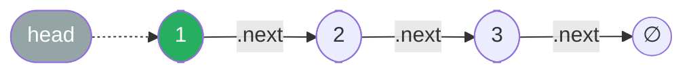

# Linked List

**TL;DR:** A chain of nodes linked by pointers instead of contiguous memory — O(1) structural edits at a known position, O(n) to reach any given position.

## When to reach for it
- The problem statement literally hands you a linked list (`ListNode`, `head`) — reversal, merging, cycle detection, k-th-from-end.
- You need O(1) insertion/removal at a known point (front of a queue, LRU eviction) without shifting every other element the way an array would.
- You're building an auxiliary structure — an adjacency list, a bucket in a hash table, an LRU cache's ordering — where nodes must be spliced in and out cheaply.
- A recognizable sub-signal: "reverse," "cycle," "middle," "k-th from end," "merge sorted lists," "the head might change."

## How it works
Each node stores a value and a reference (`.next`, and in a doubly linked list also `.prev`) to another node — never an index. Traversal always starts from a pointer you're holding (usually `head`) and follows `.next` one hop at a time; there is no "jump to position `k`" operation, so random access costs O(k).

Trace building `1 → 2 → 3` node by node:

| step | action | list so far |
|---|---|---|
| 1 | `head = ListNode(1)` | `1 → None` |
| 2 | `head.next = ListNode(2)` | `1 → 2 → None` |
| 3 | `head.next.next = ListNode(3)` | `1 → 2 → 3 → None` |



Every linked-list algorithm is really just choreographing which pointer touches which node, and in what order — see the [[Job Search/Neetcode/01. Questions/06. LinkedList/0.LinkedListGuide|Linked List Guide]] for the full "save → rewire → advance" discipline that keeps this safe.

## Why it works
The core tradeoff comes from giving up contiguous memory: you lose O(1) random access (must walk from a known pointer), but you gain O(1) structural edits **once you're at the edit point** — inserting or deleting a node is just rewiring a couple of `.next` references, no shifting of the rest of the array. This is why linked lists win exactly when the access pattern is sequential (walk once, edit as you go) and lose when the access pattern is random (need index `k` directly — use an array instead).

## Template
```python
class ListNode:
    def __init__(self, val=0, next=None):
        self.val = val
        self.next = next

# Traverse
curr = head
while curr:
    process(curr.val)
    curr = curr.next

# Insert `new_node` right after `node`
new_node.next = node.next
node.next = new_node

# Delete the node right after `node` (node itself is untouched)
node.next = node.next.next
```

## Complexity
Access/search by value: O(n) — must walk from `head`. Insert/delete given a pointer to the splice point: O(1) — just a `.next` rewrite, no shifting. Space: O(n) for `n` nodes, each with a constant-size overhead for its pointer(s).

## Common pitfalls
- Losing the rest of the list by overwriting a `.next` before saving where it pointed — always `nxt = curr.next` before you touch `curr.next`.
- Forgetting a singly linked list can't be walked backward — if you need "the previous node," either track it explicitly while walking forward, reverse first, or use a doubly linked list.
- Off-by-one errors around the head — see [[Dummy Head]] for the standard fix when the head itself might change.
- Treating list traversal as O(1) "just like an array indexing" — it's O(k) to reach position `k`, which silently turns an assumed O(n) algorithm into O(n²).

## NeetCode examples
- [[01.ReverseLinkedList|ReverseLinkedList]] — pointer rewiring fundamentals
- [[02.MergeTwoLinkedList|MergeTwoLinkedList]] — splicing nodes from two lists together
- [[07.LinkedListCycle|LinkedListCycle]] — traversal with no random access, cycle awareness
- [[09.LRUCache|LRUCache]] — doubly linked list + hash map for O(1) access and reordering

## Full guide
[[Job Search/Neetcode/01. Questions/06. LinkedList/0.LinkedListGuide|Linked List Guide]]
