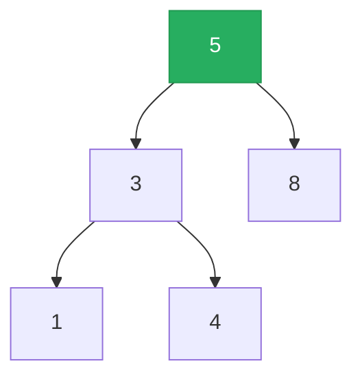

# Binary Search Tree

**TL;DR:** A [[Binary Tree]] where every left descendant is smaller and every right descendant is larger than a node — that ordering invariant gives O(h) search/insert/delete and a free sorted traversal.

## When to reach for it
- "Validate/construct/search a BST" — the ordering invariant itself is what's being tested.
- Need the k-th smallest/largest element, or values in sorted order, without sorting explicitly.
- Range queries ("count values between lo and hi") — prune entire subtrees that can't contain the range.
- Lowest common ancestor when the tree is *specifically* a BST — the invariant gives an O(h) shortcut that a general tree's LCA can't use.

## How it works
At every node, everything in the left subtree is `< node.val` and everything in the right subtree is `> node.val` — and that same rule holds recursively inside every subtree. Insert `5, 3, 8, 1, 4` in order:



| Insert | Path taken | Placement |
|---|---|---|
| 5 | — | becomes root |
| 3 | 5 → left (3<5) | left child of 5 |
| 8 | 5 → right (8>5) | right child of 5 |
| 1 | 5→left→3→left (1<5, 1<3) | left child of 3 |
| 4 | 5→left→3→right (4<5, 4>3) | right child of 3 |

Inorder traversal (left, node, right) of this tree visits `1, 3, 4, 5, 8` — already sorted, with zero explicit comparisons beyond the traversal itself.

## Why it works
Inorder visits the entire left subtree (all values `< node.val`) before the node, then the entire right subtree (all values `> node.val`) after — and this holds recursively at every level. So inorder always outputs "everything smaller than the current node" before the node and "everything larger" after, for every node in the tree simultaneously — which is exactly the definition of a sorted sequence. Search exploits the same invariant in reverse: at any node, comparing the target to `node.val` tells you which entire subtree to discard, so each comparison eliminates one whole side rather than one element — that's what makes search O(h) instead of O(n).

**The catch:** none of this saves you unless the tree is *balanced*. A BST built by inserting already-sorted data degenerates into a straight chain (each node has only a right child, say), making h = n — search, insert, and delete all fall back to O(n), same as a linked list. Self-balancing variants (AVL, red-black trees) exist specifically to guarantee h = O(log n); a plain BST makes no such guarantee.

## Template
```python
class TreeNode:
    def __init__(self, val=0, left=None, right=None):
        self.val, self.left, self.right = val, left, right

def search(root, target):
    node = root
    while node:
        if target == node.val:
            return node
        node = node.left if target < node.val else node.right
    return None

def insert(root, val):
    if not root:
        return TreeNode(val)
    if val < root.val:
        root.left = insert(root.left, val)
    else:
        root.right = insert(root.right, val)
    return root

def inorder(node, out):
    if not node:
        return
    inorder(node.left, out)
    out.append(node.val)
    inorder(node.right, out)
```

## Complexity
Time: O(h) for search/insert/delete — h = O(log n) if balanced, O(n) worst case on a degenerate tree | Space: O(h) recursion depth, O(n) for a full inorder traversal output

## Common pitfalls
- Validating a BST by only comparing each node to its immediate children — misses violations where a deep-right-subtree value is smaller than a far-left ancestor; must pass down a valid `(low, high)` range instead.
- Assuming O(log n) operations without checking whether the tree could be degenerate (e.g. built from already-sorted input).
- Forgetting that "search" can short-circuit one whole side per comparison — writing an O(n) linear scan instead of using the ordering invariant.
- Off-by-one on strict vs. non-strict inequality when duplicates are allowed — decide once whether duplicates go left or right and apply it consistently.

## NeetCode examples
- [[11.ValidateBinarySearchTree|ValidateBinarySearchTree]] — enforcing the range invariant recursively
- [[12.KthSmallestElementInABST|KthSmallestElementInABST]] — inorder traversal gives sorted order directly
- [[07.LowsetCommonAncestorOfABinarySearchTree|LowsetCommonAncestorOfABinarySearchTree]] — O(h) LCA using the ordering invariant

## Full guide
[[Job Search/Neetcode/01. Questions/07. Tree/0.TreeGuide|Tree Guide]]
