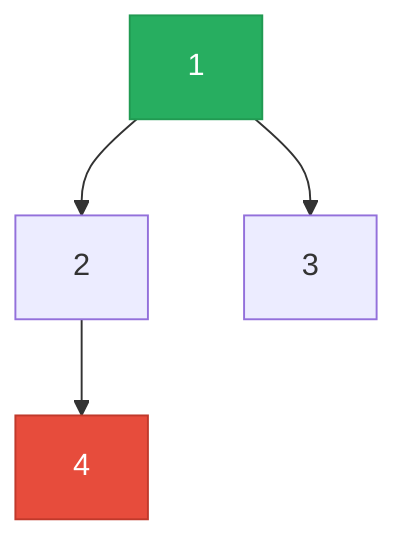

# Binary Tree

**TL;DR:** A tree where every node has at most two children — almost every problem reduces to "combine information from left and right children at each node."

## When to reach for it
- The input is explicitly a tree (`TreeNode` with `.left`/`.right`).
- You need a value that depends on subtree structure: height, diameter, balance, path sums, lowest common ancestor.
- "Level order" or "per-depth" processing → pairs naturally with [[BFS]].
- Any traversal order question (preorder/inorder/postorder) or serialization/reconstruction from traversal(s).

## How it works
Recursive [[DFS]] is the default: solve the left subtree, solve the right subtree, then combine at the current node. Trace computing height on this tree:



| Call | Left result | Right result | Return |
|---|---|---|---|
| `height(4)` | `height(None)=0` | `height(None)=0` | `1 + max(0,0) = 1` |
| `height(2)` | `height(4)=1` | `height(None)=0` | `1 + max(1,0) = 2` |
| `height(3)` | `height(None)=0` | `height(None)=0` | `1 + max(0,0) = 1` |
| `height(1)` | `height(2)=2` | `height(3)=1` | `1 + max(2,1) = 3` |

Every call waits on its children's answers before computing its own — the recursion naturally processes leaves first, root last (postorder), which is exactly what "combine children's results" requires.

## Why it works
A binary tree has no cycles and exactly one path from the root to any node, so recursion terminates automatically at `None` children — no visited set is needed, unlike general graphs. The recursive structure mirrors the problem structure: "the height of a tree" is defined in terms of "the height of its subtrees," so a function that computes height by calling itself on the subtrees is a direct translation of the definition, not a trick. This is why almost every tree DFS follows the same shape: base case at `None`, recurse left, recurse right, combine.

## Template
```python
class TreeNode:
    def __init__(self, val=0, left=None, right=None):
        self.val, self.left, self.right = val, left, right

# Generic recursive DFS: combine children's results at each node
def solve(node):
    if not node:
        return base_case
    left  = solve(node.left)
    right = solve(node.right)
    return combine(node.val, left, right)

# Level-order BFS
from collections import deque
def level_order(root):
    if not root:
        return []
    result, queue = [], deque([root])
    while queue:
        level = []
        for _ in range(len(queue)):
            node = queue.popleft()
            level.append(node.val)
            if node.left:  queue.append(node.left)
            if node.right: queue.append(node.right)
        result.append(level)
    return result
```

## Complexity
Time: O(n) — each node visited once, whether by DFS or BFS | Space: O(h) for recursive DFS (h = height; O(log n) balanced, O(n) degenerate) or O(w) for BFS (w = max width of any level)

## Common pitfalls
- Forgetting the `None` base case, causing an `AttributeError` on a missing child instead of a clean return.
- Recomputing subtree values repeatedly (e.g. calling `height()` inside a separate `diameter()` traversal) instead of returning both from one pass — turns O(n) into O(n²).
- Confusing preorder/inorder/postorder — the position of "process node" relative to the two recursive calls is the entire difference.
- Assuming the tree is balanced — a degenerate (linked-list-shaped) tree makes recursion depth O(n), risking stack overflow on unbalanced or adversarial inputs.

## NeetCode examples
- [[02.MaxDepthOfBinaryTree|MaxDepthOfBinaryTree]] — simplest combine-children pattern
- [[03.DiameterOfABinaryTree|DiameterOfABinaryTree]] — combine children while tracking a separate global answer
- [[08.BinaryTreeLevelOrderTraversal|BinaryTreeLevelOrderTraversal]] — BFS level-by-level
- [[15.SerializeAndDeserializeBinaryTree|SerializeAndDeserializeBinaryTree]] — preorder traversal to encode/reconstruct

## Full guide
[[Job Search/Neetcode/01. Questions/07. Tree/0.TreeGuide|Tree Guide]]
