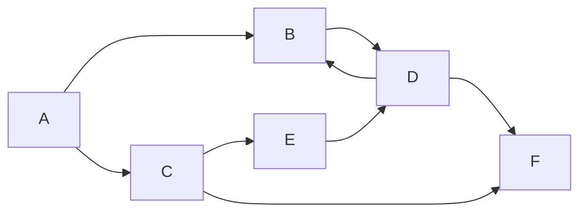

# Graph

**TL;DR:** A set of nodes connected by edges — the single abstraction that unifies traversal, connectivity, ordering, and shortest-path problems.

## When to reach for it
- The problem describes relationships between things: cities and roads, courses and prerequisites, accounts sharing an email, words differing by one letter.
- A 2D grid — each cell is a node, its up-to-4 neighbors are edges. See [[Matrix Traversal]].
- "Is X reachable from Y?", "how many groups?", "what order must these happen in?", "what's the cheapest way to connect everything?"

## How it works
Two representations dominate interview code. **Adjacency list** — a dict/array of lists, `adj[u]` = neighbors of u — is the default: compact for sparse graphs, and each node's neighbors are a direct O(1) lookup away. **Adjacency matrix** — `matrix[u][v] = weight` — trades memory (O(V²) always) for O(1) edge-existence checks, useful only when the graph is dense or you need that specific check often.



The directed graph uses this adjacency list. Neighbor order matters because both traversals process each list from left to right.

```text
A -> [B, C]
B -> [D]
C -> [E, F]
D -> [B, F]
E -> [D]
F -> []
```

The edge `D -> B` creates a cycle. The graph also has more than one route to D and F, so both traversals need a visited set.

| Traversal from A | Visit order | What controls the order |
|---|---|---|
| [[DFS]] | `A, B, D, F, C, E` | Recursion finishes B's full branch before returning to C. |
| [[BFS]] | `A, B, C, D, E, F` | A queue finishes distance 1 before distance 2. |

DFS reaches F through `A -> B -> D -> F`. BFS first reaches F through the shorter path `A -> C -> F`. Both skip later edges to nodes that were already visited.

## Why it works
Every graph algorithm is a variation on the same move: pick a frontier, expand it by following edges, and never revisit a node. What changes between algorithms is *which node the frontier expands next* — LIFO (stack) for DFS, FIFO (queue) for BFS, cheapest-tentative-distance (min-heap) for [[Dijkstra]], "no unmet prerequisites" (in-degree 0) for [[Topological Sort]]. Once a problem is reframed as "nodes and edges," the right frontier-order picks itself from what the problem is asking (shortest path vs. any path vs. valid order vs. connectivity).

## Template
```python
from collections import defaultdict

# Build an adjacency list from an edge list
def build_graph(n, edges, directed=False):
    adj = defaultdict(list)
    for u, v in edges:
        adj[u].append(v)
        if not directed:
            adj[v].append(u)
    return adj

# Weighted version
def build_weighted_graph(n, edges, directed=False):
    adj = defaultdict(list)
    for u, v, w in edges:
        adj[u].append((v, w))
        if not directed:
            adj[v].append((u, w))
    return adj
```

## Complexity
Time: building an adjacency list is O(V + E) | Space: O(V + E) for a list, O(V²) for a matrix regardless of how sparse the actual edges are — this is why matrices are avoided for large sparse graphs

## Common pitfalls
- Treating a grid as "just indices" instead of recognizing it as a graph — leads to reinventing visited-tracking and boundary checks ad hoc instead of reusing standard BFS/DFS.
- Forgetting to add both directions for an undirected edge, or accidentally adding both for a directed one.
- Not handling disconnected graphs — a single BFS/DFS from one start node misses components with no path from that node; loop over all unvisited nodes.
- Choosing an adjacency matrix out of habit for a sparse graph, ballooning memory to O(V²) for no benefit.

## NeetCode examples
- [[01.NumberOfIslands|NumberOfIslands]] — grid as an implicit graph
- [[02.CloneGraph|CloneGraph]] — explicit adjacency-list graph traversal
- [[11.NumberOfConnectedComponentsInAnUndirectedGraph|NumberOfConnectedComponentsInAnUndirectedGraph]] — connectivity over an edge list

## Full guide
[[Job Search/Neetcode/01. Questions/11. Graphs/0.GraphsGuide|Graphs Guide]]
