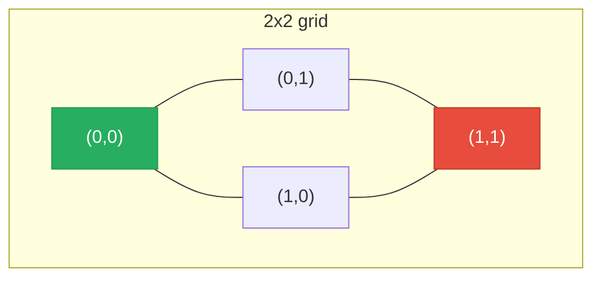

# Matrix Traversal

**TL;DR:** A 2D grid is a graph in disguise — each cell is a node, its up-to-4 (or 8) neighbors are edges reached via fixed direction offsets, so standard [[BFS]]/[[DFS]] apply directly.

## When to reach for it
- Any problem on a grid of cells: flood-fill, connected regions, shortest path in a maze.
- "Number of islands," "rotting oranges," "walls and gates" — anything phrased in terms of adjacent cells spreading a value.
- Non-graph grid patterns too: spiral order, in-place rotation, boundary walks — traversal without a visited set, just careful indexing.
- Recognize the signal: coordinates `(r, c)`, a `rows × cols` grid, and movement "up/down/left/right" or diagonally.

## How it works
Instead of building an explicit adjacency list, neighbors are computed on the fly from direction offsets:

```python
directions = [(1, 0), (-1, 0), (0, 1), (0, -1)]   # down, up, right, left
```

Trace flood-filling from `(0,0)` on a 2×2 grid of all `1`s:



| Stack | Pop | In bounds? Unvisited? | Action |
|---|---|---|---|
| `[(0,0)]` | (0,0) | yes | mark visited; push (1,0), (0,1) |
| `[(1,0),(0,1)]` | (0,1) | yes | mark visited; push (1,1), (0,0)-already-visited-later-skipped |
| `[(1,0),(1,1),(0,0)]` | (0,0) | already visited | skip |
| `[(1,0),(1,1)]` | (1,1) | yes | mark visited; neighbors already visited or out of bounds |
| `[(1,0)]` | (1,0) | already visited | skip |

All 4 cells visited — one connected component (the whole grid).

## Why it works
Treating `(r, c)` as a node identity and the four offsets as edge generation means every graph algorithm — BFS for shortest path, DFS for flood-fill/components — works unchanged; the only new discipline is bounds-checking, since a grid (unlike an adjacency list) has no natural "no such neighbor" signal and will silently wrap to negative or out-of-range indices if you don't guard for it explicitly. Marking a cell visited *before* it's expanded (not after) is what prevents the same cell from being pushed onto the stack/queue multiple times through different neighbors — identical to the visited discipline in general-graph BFS/DFS, just applied to `(r, c)` tuples instead of node IDs.

## Template
```python
def traverse(grid):
    rows, cols = len(grid), len(grid[0])
    visited = set()
    directions = [(1, 0), (-1, 0), (0, 1), (0, -1)]

    def in_bounds(r, c):
        return 0 <= r < rows and 0 <= c < cols

    def dfs(r, c):
        if not in_bounds(r, c) or (r, c) in visited or grid[r][c] != TARGET:
            return
        visited.add((r, c))
        for dr, dc in directions:
            dfs(r + dr, c + dc)

    for r in range(rows):
        for c in range(cols):
            if grid[r][c] == TARGET and (r, c) not in visited:
                dfs(r, c)   # one call per connected component
```

## Complexity
Time: O(rows × cols) — each cell visited a constant number of times across the whole traversal | Space: O(rows × cols) worst case for the visited set and recursion/queue (e.g. a grid that's entirely one connected region)

## Common pitfalls
- Missing a bounds check before indexing — `grid[nr][nc]` with a negative or overflowing index either crashes or (with negative indices in Python) silently reads the wrong cell.
- Marking visited on discovery vs. on processing inconsistently — mark the moment a cell is pushed/entered, not when it's popped, to avoid pushing the same cell multiple times.
- Mutating the grid in place as a visited marker (`grid[r][c] = '#'`) when the original values are still needed afterward — either restore them or use a separate `visited` set.
- Forgetting the outer double loop over all cells — a single traversal from one starting cell misses other disconnected regions entirely.

## NeetCode examples
- [[01.NumberOfIslands|NumberOfIslands]] — count connected components via grid DFS
- [[04.PacificAtlanticWaterFlow|PacificAtlanticWaterFlow]] — multi-source reverse traversal from grid boundaries
- [[06.RottenOranges|RottenOranges]] — multi-source BFS spreading across the grid
- [[02.SpiralMatrix|SpiralMatrix]] — traversal by shrinking boundaries instead of a visited set

## Full guide
[[Job Search/Neetcode/01. Questions/11. Graphs/0.GraphsGuide|Graphs Guide]]
