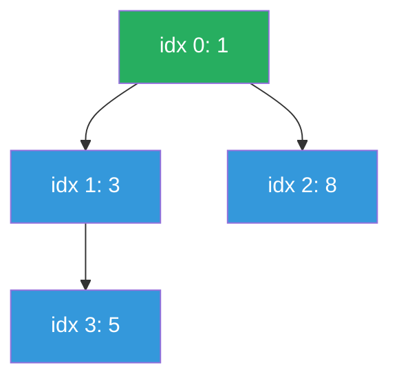

# Heap

**TL;DR:** A complete binary tree packed into an array that keeps the minimum (or maximum) at the root, giving O(log n) insert/delete and O(1) peek.

## When to reach for it
- Need the k largest/smallest elements from a stream or array.
- Repeatedly extract the minimum (or maximum) efficiently, one at a time, as new elements keep arriving.
- Merge k sorted lists/arrays.
- Scheduling or interval problems requiring the "next earliest" or "next most-frequent" event.

## How it works
A binary heap is a **complete binary tree** (every level full except possibly the last, filled left to right) stored directly in an array with no pointers: for a node at index `i`, its children live at `2i + 1` and `2i + 2`, and its parent at `(i - 1) // 2`. Completeness is what makes the array packing possible — there are never "holes."

Two operations restore the heap property (parent ≤ children) after it's disturbed:
- **Sift-up** (after push): append the new value at the end of the array, then repeatedly swap it with its parent while it's smaller than that parent.
- **Sift-down** (after pop): remove the root, move the *last* array element into the root position, then repeatedly swap it with its smaller child while it's larger than that child.

**Trace — pushing 5, 3, 8, 1 one at a time:**

| Push | Array before | Sift-up steps | Array after |
|---|---|---|---|
| 5 | `[]` | none (only element) | `[5]` |
| 3 | `[5]` | 3 < parent 5 → swap | `[3, 5]` |
| 8 | `[3, 5]` | 8 > parent 3 → stop | `[3, 5, 8]` |
| 1 | `[3, 5, 8]` | 1 < parent(idx 1)=5 → swap; 1 < parent(idx 0)=3 → swap | `[1, 3, 8, 5]` |

**Trace — popping the min from `[1, 3, 8, 5]`:**

1. Save root `1` as the result. Move the last element `5` into the root slot: `[5, 3, 8]`.
2. Sift-down: root `5` vs. children `3` (idx 1) and `8` (idx 2) — smaller child is `3`; `5 > 3` → swap: `[3, 5, 8]`.
3. Node at idx 1 (`5`) has no children left → stop.

Result: popped `1`, heap is now `[3, 5, 8]`.



## Why it works
The heap property (every parent ≤ its children) guarantees the root is always the global minimum, without requiring the array to be fully sorted. Sift-up and sift-down each only ever touch a single root-to-leaf path — and because the tree is complete, that path has length `⌈log2(n+1)⌉`, so each operation is O(log n) instead of O(n).

**Why `heapify` is O(n), not O(n log n):** naively you might expect n sift-ups (like inserting one at a time) at O(log n) each. Instead, `heapify` calls sift-down starting from the *last internal node* up to the root — never sift-up. Most nodes are leaves or near-leaves with a very short path to sift down (height ~0), and only a handful of nodes near the root have the full O(log n) height. Summing sift-down cost over all nodes: `Σ (n / 2^(h+1)) · h` for `h = 0..log n` converges to O(n), because the number of nodes at height `h` shrinks exponentially even as the per-node cost grows linearly.

## Template
```python
import heapq

# Min-heap (Python default)
heap = []
heapq.heappush(heap, val)
smallest = heapq.heappop(heap)   # removes and returns min
peek = heap[0]                   # min without removing

# Max-heap: negate values
heapq.heappush(heap, -val)
largest = -heapq.heappop(heap)

# Build heap in O(n)
heapq.heapify(nums)

# K largest elements
return heapq.nlargest(k, nums)   # O(n log k)

# Push tuples for tie-breaking: (priority, tiebreak, item)
import itertools
counter = itertools.count()
heapq.heappush(heap, (priority, next(counter), item))
```

## Complexity
Time: O(log n) push/pop — bounded by tree height, which is O(log n) for n nodes; O(1) peek — the min is always `heap[0]`; O(n) `heapify` — per the summation argument above.
Space: O(n) to store all elements, O(1) extra for push/pop themselves.

## Common pitfalls
- Python's `heapq` only implements a min-heap — negate values on push and pop to simulate a max-heap.
- Using `sorted()` plus slicing instead of a heap for streaming/online problems, throwing away the incremental O(log n) update for a full O(n log n) re-sort.
- Pushing tuples `(priority, item)` when priorities can tie and `item` isn't comparable (e.g., a custom object or dict) — Python then compares `item`s directly and raises `TypeError`. Add a monotonically increasing tiebreak counter as the middle tuple element: `(priority, tiebreak, item)`.
- Forgetting that heap order only guarantees the *root* is correct — the rest of the array is not sorted, so never index into it expecting sorted order.

## NeetCode examples
- [[04.KthLargestElementInAnArray|KthLargestElementInAnArray]] — min-heap of size k
- [[10.MergeKSortedLists|MergeKSortedLists]] — min-heap over k list heads
- [[07.FindMedianFromDataStream|FindMedianFromDataStream]] — two heaps (max-heap lower half, min-heap upper half)
- [[05.TaskScheduler|TaskScheduler]] — max-heap of task frequencies

## Full guide
[[Job Search/Neetcode/01. Questions/09. Heap or PriorityQueue/0.HeapOrPriorityQueueGuide|Heap / Priority Queue Guide]]
